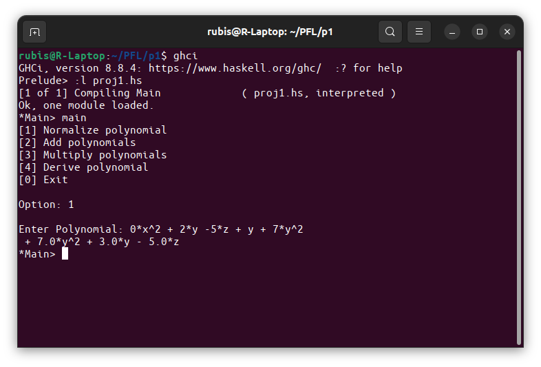
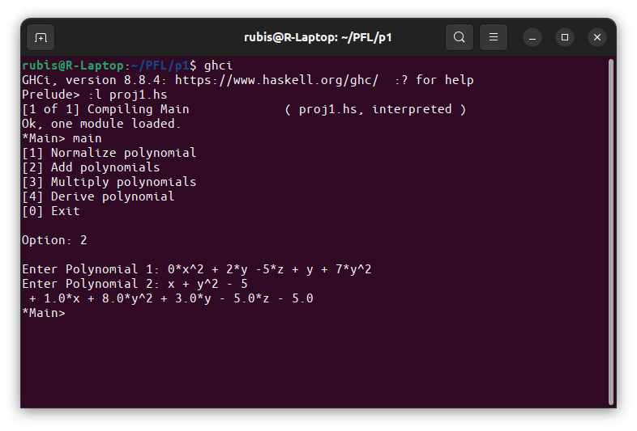
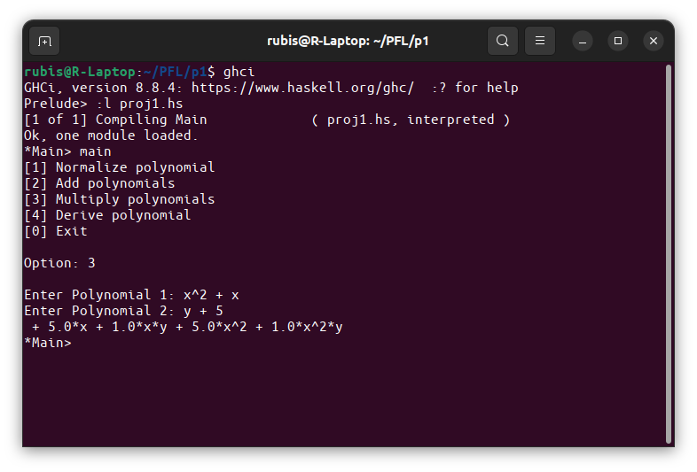
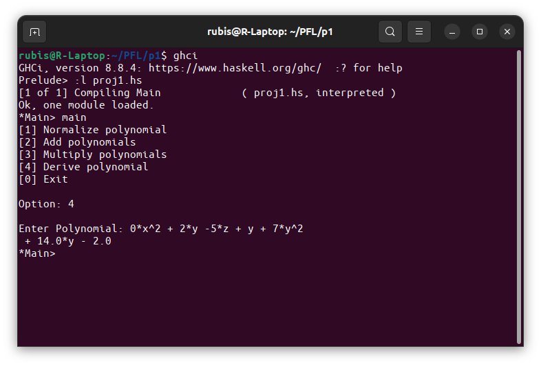

# PFL_TP1_#G12_03


## Representação interna de polinómios:

- *Representação interna*.
- *Code*:

```
data Poly = Poly {var :: String, coes :: [Float]} deriving (Show, Ord, Eq)
```

### Descrição da escolha:

- Considerando os polinómios, fez-se uma repartição em variáveis do tipo `string` e coeficientes do tipo `float`.

### Justificação da escolha:

- Recorrendo a conhecimentos matemáticos prévios e ao pensamento na altura de início do projeto pareceu-nos uma das formas mais fáceis e eficientes de representar o polinómio.

## Funcionalidades e breve descrição da estratégia de implementação de cada uma:

### Funcionalidades/ Funções principais:

- *normalizePolynomial*: Função que realiza a normalização dos polinómios, ou seja, coloca-os na forma normal.
- *Descrição de estratégia*: Iterar a lista do polinómios de forma recursiva e ao comparar dois polinómios se tivessem a mesma variável juntam-se as listas dos dois, caso contrário mantinham-se os polinómios iguais.
- *Code*:

```
normalizePolynomial :: [Poly] -> [Poly]
normalizePolynomial [] = []
normalizePolynomial pl = normRec [] pl
```

- *addPolynomials*: Função que realiza a adição dos polinómios.
- *Descrição de estratégia*: Fazer a normalização da concatenação dos dois polinómios.
- *Code*:

```
addPolynomials :: [Poly] -> [Poly] -> [Poly]
addPolynomials [] pl = pl
addPolynomials pl [] = pl
addPolynomials pl1 pl2 = normalizePolynomial (pl1 ++ pl2)
```

- *multiplyPolynomials*: Função que realiza a multiplicação dos polinómios.
- *Descrição de estratégia*: Para cada elemento do primeiro polinómio multiplicar com todos os elementos do segundo polinómio.
- *Code*:

```
multiplyPolynomials :: [Poly] -> [Poly] -> [Poly]
multiplyPolynomials [] _ = [0]
multiplyPolynomials _ [] = [0]
multiplyPolynomials pl1 pl2 = normalizePolynomial (multiply pl1 pl2) 
```

- *derivePolynomial*: Função que realiza a derivação dos polinómios.
- *Descrição de estratégia*: Tendo um polinómio, pega-se na cauda da lista dos coeficientes deste e multiplica-se pelo seu indíce mais um.
- *Code*:

```
derivePolynomial :: [Poly] -> [Poly]
derivePolynomial [] = []
derivePolynomial pl = normalizePolynomial (derivePoly pl)
```

## Exemplos de utilização que permitam testar todas as funcionalidades do programa:

- Chamar a função `main`, intoduzir o número correspondente à opção desejada como descrito abaixo.





## Adicional:

- *versão usada*: 8.8.4 (recomendada pelo enunciado: 9.0.1).
- *imports utilizados*: `import Data.List`, `import Data.Char` e `import Data.List.Split`
- *menu*: Realizou-se um menu para facilitar a interação do utilizador com o programa.
- *Descrição de estratégia*: Está repartido por quatro opções de trabalho (*1 - Normalizar polinómios*, *2 - Adicionar polinómios*, *3 - Multiplicar polinómios*, *4 - Derivar polinómios*) e uma opção de saída (*0 - exit*).
- *Code*:

```
main = do
        putStr "[1] Normalize polynomial\n[2] Add polynomials\n[3] Multiply polynomials\n[4] Derive polynomial\n[0] Exit\n\n"
        putStr "Option: "
        str <- getLine
        putStr "\n"
        let opt = read str
        if (opt == 1) then
            do
                putStr "Enter Polynomial: "
                pol <- getLine
                putStrLn (showPoly (normalizePolynomial (stringToPolyList pol)))
        else if (opt == 2) then
            do
                putStr "Enter Polynomial 1: "
                pol1 <- getLine
                putStr "Enter Polynomial 2: "
                pol2 <- getLine
                putStrLn (showPoly (addPolynomials (stringToPolyList pol1) (stringToPolyList pol2)))
        else if (opt == 3) then
            do
                putStr "Enter Polynomial 1: "
                pol1 <- getLine
                putStr "Enter Polynomial 2: "
                pol2 <- getLine
                putStrLn (showPoly (multiplyPolynomials (stringToPolyList pol1) (stringToPolyList pol2)))
        else if (opt == 4) then
            do
                putStr "Enter Polynomial: "
                pol <- getLine
                putStrLn (showPoly (derivePolynomial (stringToPolyList pol)))
        else if (opt == 0) then
            putStrLn "exit"
        else
            main
```
